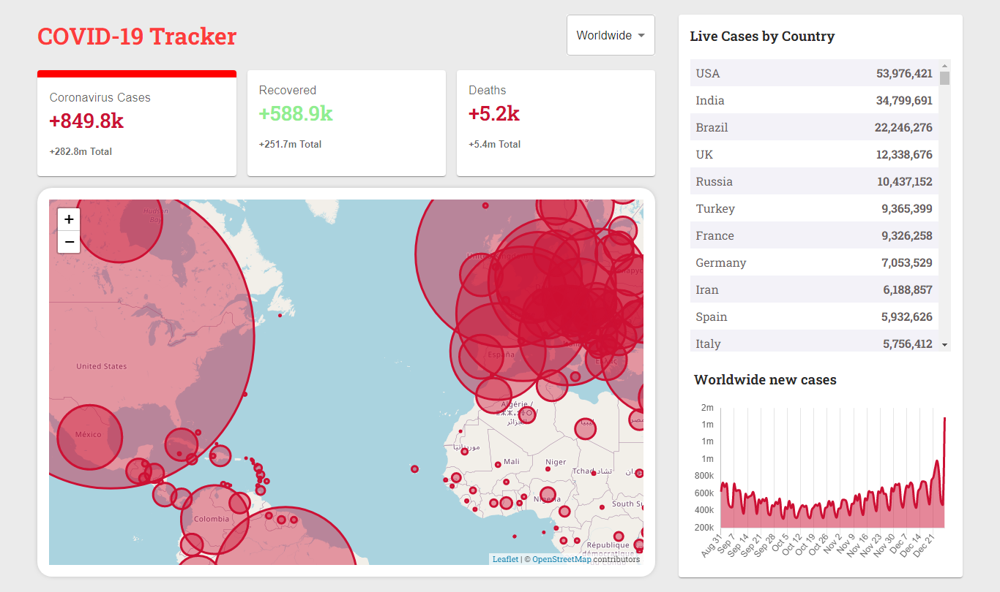

<div align="center">
<h1>COVID-19 Live Tracker</h1>

</div>

## Functionalities

-   [x] Daily updates about Corona Virus cases Globally and Country wise.
-   [x] Separate data for each case type; live cases, recovered, deaths.
-   [x] Separate data for each country in table format.
-   [x] Graphical Analysis of growth, recovered and death rates with respect to month.
-   [x] Map Representation (with Interactive Tooltip) of Corona Cases across the Globe.

## Technologies Used

-   [React](https://reactjs.org/)
-   [Material UI](https://mui.com/)
-   [chart.js](https://www.chartjs.org/)
-   [leaflet](https://leafletjs.com/)
-   [disease.sh](https://disease.sh/) (Open Disease Data API)
-   [react-chartjs-2](https://react-chartjs-2.netlify.app/) (React components for Chart.js)
-   [react-leaflet](https://react-leaflet.js.org/) (React components for Leaflet maps)

## Installation

```
git clone https://github.com/gulraiznoorbari/COVID-19_Tracker.git
cd COVID-19_Tracker
npm install
npm start
```

## For Production Build

```
npm build
```

## Author

You can get in touch with me on my LinkedIn Profile:

#### Gulraiz Noor Bari

[](https://www.linkedin.com/in/gulraiznoorbari)
<br />
[](https://twitter.com/gulraiznoorbari)

You can also follow my GitHub Profile to stay updated about my latest projects: [](https://github.com/gulraiznoorbari)

If you liked the repo then kindly support it by giving it a star ⭐!

## Contributions Welcome

[](#)

If you find any bug in the code or have any improvements in mind then feel free to generate a pull request.
